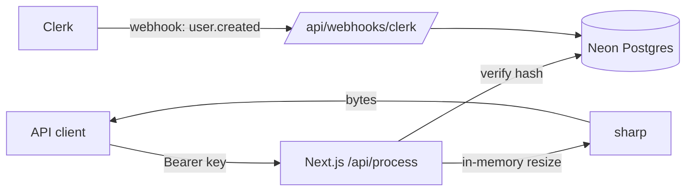

# Morphica

Stateless, serverless image processing — one request, zero persistence.


## Install

```bash
git clone <repo-url> morphica && cd morphica
cp .env.example .env.local   # fill Clerk + Neon keys
npm install
npm run db:migrate
npm run dev                  # http://localhost:3000
```

Then point a Clerk webhook at `https://your-domain/api/webhooks/clerk` (subscribe to `user.created`).

## Usage

```bash
curl -X POST https://morphica.app/api/process \
  -H "Authorization: Bearer <api_key>" \
  -F image=@photo.jpg -F op=resize -F width=800
```

Create API keys in the dashboard; processed bytes come back in the response.

## API Reference

| Method | Endpoint | Auth | Description |
|--------|----------|------|-------------|
| `POST` | `/api/process` | `Bearer <api_key>` | Resize an image (jpeg/png/webp/gif, ≤ 3 MB) |

**Request fields:** `image` (file, required) · `op` (`resize`) · `width` / `height` (int ≥ 1, at least one required)
**Response:** `200` image bytes, or `400`/`401`/`413`/`415` JSON error.

## Features

- Images processed in memory with sharp — nothing is stored, ever
- API keys hashed at rest; usage logged asynchronously via `after()`
- Dashboard: key management + usage stats

## Environment Variables

```bash
NEXT_PUBLIC_CLERK_PUBLISHABLE_KEY=   # required
CLERK_SECRET_KEY=                    # required
CLERK_WEBHOOK_SECRET=                # required — verify webhooks
DATABASE_URL=                        # required — Neon pooled connection
APP_URL=http://localhost:3000
```

## Architecture



## Development

```bash
npm run build && npm start
npm run lint
npm run db:generate   # drizzle-kit
```

## License

[MIT](LICENSE)
